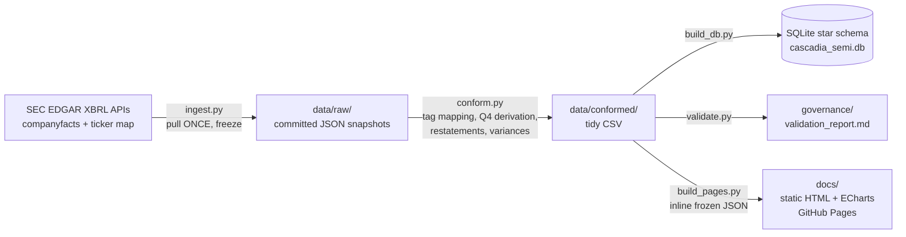

# Cascadia Semiconductors

**Financial analytics on real SEC filing data — FormFactor (NASDAQ: FORM) and
semiconductor test & measurement peers.** Part of the
[Cascadia portfolio](https://robbinsanalytics.github.io) by Aaron Robbins.

**Live site:** https://robbinsanalytics.github.io/cascadia-semiconductors/

An executive-style financial pack — headline → driver → variance — built
entirely from public SEC EDGAR XBRL filings, with the data-governance
discipline shown as a first-class feature: explicit tag mapping, derived-value
flags, restatement handling, fiscal-calendar conformance, and automated
reconciliation. GAAP throughout, honestly labeled.

## Architecture



- **Python** (requests + pandas ecosystem, pinned in `requirements.txt`) does
  ingestion and processing; every script is written as a teaching artifact.
- **The data is frozen.** `data/raw/` holds the committed EDGAR responses
  pulled **2026-07-21**; everything downstream rebuilds from that snapshot,
  offline. The as-of date is stamped in every output and on every page.
  FormFactor reported Q2 FY2026 on 2026-07-29 — deliberately *not* included;
  refreshing the snapshot is a manual, intentional act (re-run `ingest.py`).
- **SQLite star schema** (`dim_company`, `dim_metric`, `dim_date`,
  `fact_financials_quarterly`) mirrors the dimensional modeling used across
  the Cascadia builds. The conformed CSV is the canonical hand-off.
- **Frontend** is dependency-light static HTML with
  [Apache ECharts](https://echarts.apache.org/) from CDN, hosted free on
  GitHub Pages. The frozen data is inlined into the page at build time — the
  site makes **no SEC calls at runtime** and works offline/forever.

## Governance moves (the point of the project)

| Concern | Handling |
|---|---|
| Tag drift (companies switch XBRL tags) | Priority-ordered tag map per metric — [`governance/tag_mapping.csv`](governance/tag_mapping.csv) |
| No discrete Q4 filings | Q4 = FY − (Q1+Q2+Q3), flagged `derived`, footnoted on-page |
| Amended/restated filings | Latest filed value wins, flagged `restated` |
| 52/53-week fiscal calendars | Nearest-calendar-quarter mapping, rule in [`governance/conformance_rules.md`](governance/conformance_rules.md) |
| Missing data | Flagged, never filled — no interpolation, no estimates |
| GAAP vs non-GAAP | Everything labeled GAAP; pages note that company headline figures may be non-GAAP |
| Segment data is dimensional (not in `companyfacts`) | Pulled from filing XBRL instances as a dated freeze extension (`ingest_segments.py`); segment revenue tied out to consolidated, gross margin gated to the periods with a filed reconciling line |
| Verification | [`governance/validation_report.md`](governance/validation_report.md), auto-generated by `validate.py`: FY reconciliation, cross-foot identity (including divestiture gains), gap audit, segment revenue tie-out, segment gross-profit bridge, press-release spot-check table |

## Rebuild from the frozen snapshot (offline)

```powershell
pip install -r requirements.txt
python src/conform.py           # raw JSON  -> tidy CSV + tag map
python src/conform_segments.py  # segment raw JSON -> segment CSV (+ appends tag map; run AFTER conform.py)
python src/build_db.py          # tidy CSVs -> SQLite star schema (+ dim_segment / fact_segment_quarterly)
python src/validate.py          # checks    -> governance/validation_report.md (exit 1 on failure)
python src/build_pages.py       # tidy CSVs -> docs/ JSON + inline data injection (index.html + margins.html)
```

`python src/ingest.py` re-pulls the consolidated `companyfacts` bundle from SEC
and **overwrites the freeze** — only run it to deliberately refresh the dataset.
`python src/ingest_segments.py` is the Phase B **freeze extension**: it pulls the
dimensional segment facts (absent from `companyfacts`) from the individual filing
XBRL instances, at the same as-of date, and never touches the Phase A series.

## Data citation

U.S. Securities and Exchange Commission, EDGAR XBRL APIs
(`companyfacts`, https://data.sec.gov/), retrieved **2026-07-21** under the
SEC's [fair-access guidelines](https://www.sec.gov/os/accessing-edgar-data)
(declared User-Agent, throttled well under rate limits). SEC filing data is
public domain; repository code is MIT-licensed (see `LICENSE`).

## Phases

- **Phase A (live):** FormFactor executive financial pack — GAAP revenue,
  gross margin, opex, operating income, diluted EPS, FY2018 → Q1 FY2026, with
  QoQ/YoY variances. → [`docs/index.html`](docs/index.html)
- **Phase B (live):** GAAP gross-margin walk (trend + revenue/margin
  decomposition) and the Probe Cards vs Systems segment view, built from
  dimensional segment XBRL pulled from the filing instances. Segment revenue
  reconciles to consolidated revenue every quarter; segment gross margin is shown
  only where FormFactor files the reconciling line (FASB ASU 2023-07, FY2024+) so
  it ties to consolidated GAAP gross profit exactly — earlier periods are flagged
  "not reconcilable," never estimated. → [`docs/margins.html`](docs/margins.html)
- **Phase C (planned):** US-listed test & measurement peer benchmark (TER,
  ONTO, CAMT, COHU, INTT, plus KLAC as the process-control margin reference).
  Honest scope note: FormFactor's closest probe-card competitors (Technoprobe,
  Micronics Japan, JEM) don't file with the SEC, so this is a US-listed peer
  set, not a pure probe-card comp group.

---

*Built from public SEC filings (EDGAR XBRL APIs), as-of 2026-07-21.
Independent portfolio project — not affiliated with, endorsed by, or based on
any non-public information from any company shown. Not investment advice.*
